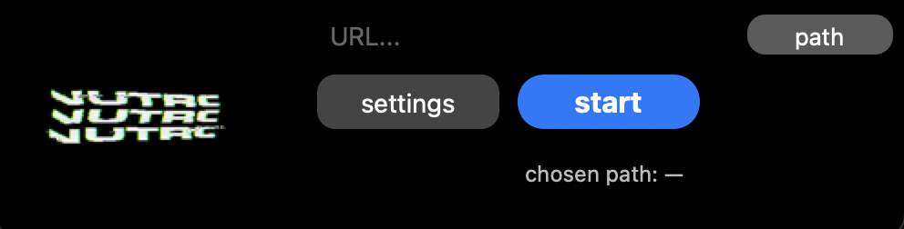

# mp3conv

A small Python module for downloading and converting YouTube videos using [yt-dlp](https://github.com/yt-dlp/yt-dlp). <br>


## Features

- Download audio as `.mp3`
- Optionally download full videos as `.mp4` (up to 1080p)
- Supports single YouTube URLs

## Requirements

- Python 3.7+
- `yt-dlp`
- `ffmpeg` (required for audio extraction and video merging)

### Installation

```bash
pip install yt-dlp
